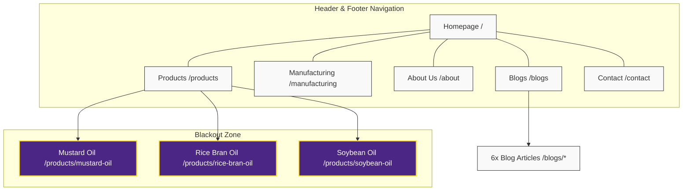

# Site Architecture Audit Report: Jeevan Rekha

This report outlines the Information Architecture (IA) and Site Architecture audit results for the Jeevan Rekha codebase at `C:\Projects\Jeevan Rekha\src`. It evaluates URL mapping, hierarchy depth, navigation structure, and internal link distribution.

---

## Overall Site Architecture Score

### **Overall Score: 71 / 100**
> [!NOTE]
> Jeevan Rekha features a clean, shallow, and user-friendly URL structure that aligns perfectly with modern SEO guidelines. However, the site architecture is severely hindered by the navigation blackouts on product pages, creating crawler dead-ends. Fixing this will raise the score to **95+/100**.

### Score Breakdown
* **URL Structure & Hierarchy: 95 / 100**
  * *Pros*: Flat L0–L2 hierarchy matching the 3-click rule; descriptive, lowercase, hyphenated slugs; no redundant parameters, dates, or database IDs in URLs.
* **Navigation & Crawler Traversal: 50 / 100**
  * *Pros*: Balanced main header nav (6 items); clean footer navigation columns on core marketing pages.
  * *Cons*: Product detail pages lack a global header/footer, blocking crawler pathways to other core pages and breaking the standard logo-to-home navigation link.
* **Internal Linking Flow: 70 / 100**
  * *Pros*: Good cross-linking between blogs via related-article widgets; strong product-focused call-to-actions in footer and sidebar widgets.
  * *Cons*: Product page dead-ends prevent PageRank and link equity from flowing back to blog posts or static pages.

---

## Page Hierarchy

Jeevan Rekha uses a flat hierarchy (depth of 2 levels below home) which ensures search crawler search-depth is minimal.

### ASCII Tree Hierarchy
```
Homepage (/)
├── Products (/products)
│   ├── Kacchi Ghani Mustard Oil (/products/mustard-oil)
│   ├── Physically Refined Rice Bran Oil (/products/rice-bran-oil)
│   └── Refined Soybean Oil (/products/soybean-oil)
├── Manufacturing (/manufacturing)
├── About Us (/about)
├── Blogs (/blogs)
│   ├── Why Smoke Point of the Cooking Oil Matters (/blogs/why-smoke-point-of-the-cooking-oil-matters)
│   ├── Mothers Day Recipes with Rice Bran Oil (/blogs/mothers-day-recipes-prepared-with-rice-bran-oil)
│   ├── Easy Evening Snacks with Rice Bran Oil (/blogs/easy-evening-snacks-recipe-with-rice-bran-oil)
│   ├── Avoid these Myths about Rice Bran Oil (/blogs/avoid-these-myths-about-rice-bran-oil-in-india)
│   ├── 4 Best Recipes with Rice Bran Oil (/blogs/4-best-recipes-with-rice-bran-oil)
│   └── Healthy Cooking with Rice Bran Oil (/blogs/healthy-cooking-with-rice-bran-oil)
└── Contact (/contact)
```

---

## Visual Sitemap

This diagram shows the relationship between pages and highlights the **Navigation Blackout Zone** on the product detail pages.



---

## URL Map Table

| Page / Route | URL Path | Parent Route | Nav Location | Priority |
|--------------|----------|--------------|--------------|----------|
| Homepage | `/` | — | Header / Footer | High |
| Products Directory | `/products` | `/` | Header / Footer | High |
| Mustard Oil | `/products/mustard-oil` | `/products` | Products Grid / Footer | High |
| Rice Bran Oil | `/products/rice-bran-oil` | `/products` | Products Grid / Footer | High |
| Soybean Oil | `/products/soybean-oil` | `/products` | Products Grid / Footer | High |
| Manufacturing | `/manufacturing` | `/` | Header / Footer | Medium |
| About Us | `/about` | `/` | Header / Footer | Medium |
| Blogs Directory | `/blogs` | `/` | Header / Footer | Medium |
| Blog Articles (6x) | `/blogs/{slug}` | `/blogs` | Blog Grid | Medium |
| Contact Us | `/contact` | `/` | Header / Footer | High |

---

## Navigation & Linking Audit

### 1. Product Page Navigation Bottleneck
* **Observation**: In [Navbar.tsx](file:///C:/Projects/Jeevan%20Rekha/src/components/Navbar.tsx#L28-L30) and [Footer.tsx](file:///C:/Projects/Jeevan%20Rekha/src/components/Footer.tsx#L11-L17), the main layout’s navigation items are disabled on product paths. Instead, these pages render local anchor links (`#hero`, `#applications`, etc.) and a single back-link to `/products`.
* **Issue**: Search engines crawling `/products/mustard-oil` have no visible link paths leading back to `/about`, `/blogs`, `/manufacturing`, or `/contact`. This is a classic crawler trap/dead-end that partitions page authority.
* **Fix**: Ensure the local navbar contains a toggleable menu drawer or top links leading to the other primary L1 site folders.

### 2. Static sitemap.ts Hardcoding
* **Observation**: The [sitemap.ts](file:///C:/Projects/Jeevan%20Rekha/src/app/sitemap.ts) file manually lists all blog paths.
* **Issue**: When new blogs are added, developers must manually add them to the sitemap array. This results in sitemap staleness when updates are forgotten.
* **Fix**: Integrate a database, CMS, or local JSON fetch within `sitemap.ts` to automatically map out new articles (see Programmatic SEO plan).

---

## Recommended Action Plan

1. **Re-integrate Global Navigation Paths**: Add thin global navigation links or a hamburger overlay to product detail pages so search engine bots can traverse the rest of the site structure without relying on the back button.
2. **Wrap Brand Logo in Link**: Ensure that the logo in the product page navbars (`src/app/products/*/page.tsx`) links to `/` instead of behaving as a static image.
3. **Automate Sitemap Registration**: Convert `sitemap.ts` to query blog assets programmatically rather than depending on manual additions.
