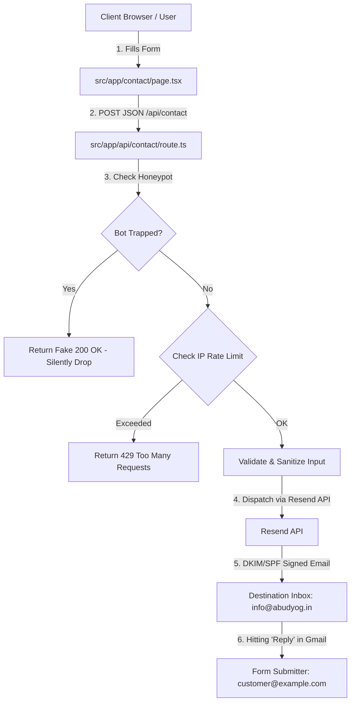

# Resend Contact Form Integration & Security Playbook

> **Reusable Production Guide & Code Template**  
> Use this document as a step-by-step master template when implementing secure, spam-proof, high-deliverability contact forms on Next.js (App Router) websites using the Resend API.

---

## Table of Contents
1. [Architecture Overview](#1-architecture-overview)
2. [Step 1: Installation & Environment Variable Security](#step-1-installation--environment-variable-security)
3. [Step 2: Resend Domain Authentication & Primary Inbox Delivery](#step-2-resend-domain-authentication--primary-inbox-delivery)
4. [Step 3: Security & Anti-Spam Architecture](#step-3-security--anti-spam-architecture)
5. [Step 4: Server-Side API Route (`src/app/api/contact/route.ts`)](#step-4-server-side-api-route)
6. [Step 5: Client-Side Contact Form Component (`src/app/contact/page.tsx`)](#step-5-client-side-contact-form-component)
7. [Step 6: Vercel Production Deployment Checklist](#step-6-vercel-production-deployment-checklist)
8. [Client Adaptation Checklist (< 15 Min Setup)](#client-adaptation-checklist)

---

## 1. Architecture Overview



### Key Technical Specifications
* **Framework:** Next.js (App Router, Turbopack, TypeScript)
* **Email Provider:** Resend Node.js SDK (`resend`)
* **Sender Domain Authentication:** Custom Domain via Resend DNS Records (DKIM + SPF + DMARC)
* **Reply-To Direct Routing:** Sets `replyTo` header to visitor's email address
* **Security Shield:** IP Rate Limiting + Honeypot Trap + Length Constraints + HTML Sanitization + Header Injection Prevention

---

## Step 1: Installation & Environment Variable Security

### 1. Install Resend SDK
```bash
npm install resend
```

### 2. Configure `.env.local` (Local Development)
Create `.env.local` in your project root. **Never commit `.env.local` to Git.**

```env
# Resend API Key (obtain from https://resend.com/api-keys)
RESEND_API_KEY=re_BQNyh5rf_FVAPJJiBJyeRvCc8AoaikJAN

# Primary Recipient Inbox (Where contact queries land)
CONTACT_RECIPIENT_EMAIL=info@abudyog.in

# Authenticated Sender Address (Must match a verified domain in Resend)
RESEND_FROM_EMAIL=Jeevan Rekha Website <notifications@jeevanrekhafoods.com>
```

### 3. Create `.env.example` (Git Template)
```env
# Resend API Key for Website Contact Form
RESEND_API_KEY=your_resend_api_key_here
CONTACT_RECIPIENT_EMAIL=info@yourdomain.com
RESEND_FROM_EMAIL=Brand Name <notifications@yourdomain.com>
```

### 4. Verify `.gitignore`
Ensure `.env*` or `.env.local` is present in `.gitignore`:
```gitignore
# env files
.env*
```

---

## Step 2: Resend Domain Authentication & Primary Inbox Delivery

### Why Test Emails Go to Spam (And How to Fix It)
* **Default Sandbox Sender (`onboarding@resend.dev`):** Mail providers (Gmail, Outlook) automatically filter emails from `@resend.dev` into **Spam** because thousands of free testing accounts use it without domain cryptographic signatures.
* **Verified Domain Sender (`notifications@yourdomain.com`):** Once DNS records are added, Resend signs every email with **DKIM, SPF, and DMARC** cryptographic signatures. Email servers verify authenticity and deliver **directly to the Primary Inbox**.

### Adding Custom Domains in Resend (Step-by-Step)
1. Log in to [resend.com/domains](https://resend.com/domains).
2. Click **Add Domain** and enter your domain (e.g. `jeevanrekhafoods.com` or `abudyog.in`).
3. Add the generated DNS records to your Domain Host (Cloudflare, GoDaddy, Namecheap):
   - **TXT Record (DKIM):** `resend._domainkey` $\rightarrow$ `p=MIGfMA0GCS...`
   - **MX Record (SPF):** `send` $\rightarrow$ `feedback-smtp.us-east-1.amazonses.com`
4. Click **Verify Domain** in Resend. Status will turn to **Verified** ✅.

### How `replyTo` Routing Works
By passing `replyTo: email.trim()` to the Resend API:
* **Email arrives in Inbox:** Sender shows as `Jeevan Rekha Website <notifications@jeevanrekhafoods.com>`.
* **When you click "Reply":** Your email client automatically sets the recipient address to the customer's email (`customer@example.com`).

---

## Step 3: Security & Anti-Spam Architecture

Every production contact form must implement 5 defense layers against spam bots, DoS attacks, and malicious exploits:

| Layer | Defense Mechanism | Implementation Strategy |
| :--- | :--- | :--- |
| **1. Honeypot Trap** | Catches automated spambots | Hidden input field `website_url` (`display: none`). Humans leave it blank; bots fill it out. If filled, return fake success without sending email. |
| **2. Rate Limiting** | Prevents DoS & API quota exhaustion | In-memory sliding window tracking IP addresses. Max 5 submissions per 10 minutes per IP. Exceeded requests get `429 Too Many Requests`. |
| **3. Header Injection Prevention** | Blocks CRLF exploits | Strip `\r` and `\n` characters from string inputs before constructing email subject and headers. |
| **4. Input Length Limits** | Prevents payload inflation DoS | Enforce strict max lengths: Name (100 chars), Email (150 chars), Message (3,000 chars). |
| **5. HTML Sanitization** | Prevents XSS / HTML injection | Escape special characters (`<`, `>`, `&`, `"`, `'`) before rendering in email HTML body. |

---

## Step 4: Server-Side API Route (`src/app/api/contact/route.ts`)

Copy & paste this complete TypeScript file into `src/app/api/contact/route.ts`:

```typescript
import { NextResponse } from 'next/server';
import { Resend } from 'resend';

// Initialize Resend SDK (Reads API key safely from environment variable)
const resend = new Resend(process.env.RESEND_API_KEY);

const enquiryLabels: Record<string, string> = {
  retail: '🛒 Retail Order',
  bulk: '📦 Bulk / B2B Order',
  distribution: '🚚 Distribution Inquiry',
  partnership: '🤝 Partnership Proposal',
  other: 'General Inquiry',
};

const productLabels: Record<string, string> = {
  'rice-bran': 'Physically Refined Rice Bran Oil',
  mustard: 'Kacchi Ghani Mustard Oil',
  soybean: 'Refined Soybean Oil',
  all: 'All / Multiple Products',
};

// -----------------------------------------------------------------------------
// Security Layer 1: In-Memory IP Rate Limiting (Max 5 requests per 10 min per IP)
// -----------------------------------------------------------------------------
interface RateLimitRecord {
  count: number;
  resetTime: number;
}
const rateLimitMap = new Map<string, RateLimitRecord>();

function isRateLimited(ip: string): boolean {
  const now = Date.now();
  const windowMs = 10 * 60 * 1000; // 10 Minutes
  const maxRequests = 5;

  const record = rateLimitMap.get(ip);

  if (!record || now > record.resetTime) {
    rateLimitMap.set(ip, { count: 1, resetTime: now + windowMs });
    return false;
  }

  if (record.count >= maxRequests) {
    return true;
  }

  record.count += 1;
  return false;
}

// Clean up expired rate limit entries every 5 minutes
if (process.env.NODE_ENV !== 'test') {
  setInterval(() => {
    const now = Date.now();
    for (const [ip, record] of rateLimitMap.entries()) {
      if (now > record.resetTime) {
        rateLimitMap.delete(ip);
      }
    }
  }, 5 * 60 * 1000);
}

// -----------------------------------------------------------------------------
// POST Handler Endpoint
// -----------------------------------------------------------------------------
export async function POST(request: Request) {
  try {
    // 1. IP Rate Limiting Check
    const ip =
      request.headers.get('x-forwarded-for')?.split(',')[0]?.trim() ||
      request.headers.get('x-real-ip') ||
      request.headers.get('cf-connecting-ip') ||
      '127.0.0.1';

    if (isRateLimited(ip)) {
      return NextResponse.json(
        { error: 'Too many requests. Please wait a few minutes before submitting again.' },
        { status: 429 }
      );
    }

    const body = await request.json();
    const { fname, company, email, phone, enquiry, product, message, website_url } = body;

    // 2. Honeypot Anti-Spam Check: If bot autofilled hidden website_url field, return fake 200 without sending
    if (website_url && String(website_url).trim().length > 0) {
      return NextResponse.json({ success: true, id: 'hp-filtered' });
    }

    // 3. Strict Server-Side Input Validation & Length Boundaries
    if (!fname?.trim() || typeof fname !== 'string') {
      return NextResponse.json({ error: 'Full name is required' }, { status: 400 });
    }
    if (fname.trim().length > 100) {
      return NextResponse.json({ error: 'Full name is too long (max 100 characters)' }, { status: 400 });
    }

    if (!email?.trim() || typeof email !== 'string' || !/^[^\s@]+@[^\s@]+\.[^\s@]+$/.test(email.trim())) {
      return NextResponse.json({ error: 'Valid email address is required' }, { status: 400 });
    }
    if (email.trim().length > 150) {
      return NextResponse.json({ error: 'Email address is too long (max 150 characters)' }, { status: 400 });
    }

    if (!message?.trim() || typeof message !== 'string') {
      return NextResponse.json({ error: 'Message body is required' }, { status: 400 });
    }
    if (message.trim().length > 3000) {
      return NextResponse.json({ error: 'Message is too long (max 3000 characters)' }, { status: 400 });
    }

    if (!enquiry || typeof enquiry !== 'string') {
      return NextResponse.json({ error: 'Enquiry type is required' }, { status: 400 });
    }

    // 4. Header Injection Prevention (Strip CRLF \r and \n)
    const sanitizeHeader = (str: string) => str.replace(/[\r\n]/g, '').trim();

    const cleanFname = sanitizeHeader(fname);
    const cleanEmail = sanitizeHeader(email);
    const cleanCompany = company && typeof company === 'string' ? sanitizeHeader(company).slice(0, 150) : '';
    const cleanPhone = phone && typeof phone === 'string' ? sanitizeHeader(phone).slice(0, 30) : '';

    const enquiryTypeFormatted = enquiryLabels[enquiry] || sanitizeHeader(enquiry) || 'Website Inquiry';
    const productFormatted = productLabels[product] || (product ? sanitizeHeader(String(product)) : 'Not specified');
    const companyFormatted = cleanCompany ? cleanCompany : 'N/A';
    const phoneFormatted = cleanPhone ? cleanPhone : 'N/A';

    // Format Subject Line with mandatory [JR Website] Prefix
    const cleanSubjectTitle = enquiryTypeFormatted.replace(/^[^\w\s]+\s*/, '');
    const subject = `[JR Website] ${cleanSubjectTitle} Inquiry from ${cleanFname}`;

    // Target Inbox & Authenticated Domain Sender
    const recipientEmail = process.env.CONTACT_RECIPIENT_EMAIL || 'info@abudyog.in';
    const fromEmail = process.env.RESEND_FROM_EMAIL || 'Jeevan Rekha Website <notifications@jeevanrekhafoods.com>';

    // Submission Timestamp (IST)
    const now = new Date();
    const formattedDate = new Intl.DateTimeFormat('en-IN', {
      dateStyle: 'full',
      timeStyle: 'medium',
      timeZone: 'Asia/Kolkata',
    }).format(now);

    // Escape HTML Special Characters to Prevent Injection in Email Clients
    const sanitizeHtml = (str: string) =>
      str.replace(/[&<>"']/g, (m) => ({ '&': '&amp;', '<': '&lt;', '>': '&gt;', '"': '&quot;', "'": '&#39;' }[m] || m));

    const cleanMessageText = sanitizeHtml(message.trim()).replace(/\n/g, '<br />');

    // HTML Email Template (Compatible with Gmail, Outlook, Apple Mail)
    const htmlContent = `
<!DOCTYPE html>
<html lang="en">
<head>
  <meta charset="UTF-8">
  <meta name="viewport" content="width=device-width, initial-scale=1.0">
  <title>${sanitizeHtml(subject)}</title>
</head>
<body style="margin: 0; padding: 0; background-color: #f4f3f8; font-family: 'Helvetica Neue', Helvetica, Arial, sans-serif; color: #2d2b38; -webkit-font-smoothing: antialiased;">
  <table width="100%" border="0" cellspacing="0" cellpadding="0" style="background-color: #f4f3f8; padding: 30px 15px;">
    <tr>
      <td align="center">
        <table width="100%" max-width="620" border="0" cellspacing="0" cellpadding="0" style="max-width: 620px; background-color: #ffffff; border-radius: 12px; overflow: hidden; box-shadow: 0 8px 30px rgba(0,0,0,0.08); border: 1px solid #e6e2f0;">
          
          <!-- BRAND HEADER -->
          <tr>
            <td style="background: linear-gradient(135deg, #1D1240 0%, #351C6E 100%); padding: 32px 35px; text-align: left; position: relative;">
              <table width="100%" border="0" cellspacing="0" cellpadding="0">
                <tr>
                  <td>
                    <div style="font-size: 24px; font-weight: 700; color: #ffffff; letter-spacing: 0.5px; line-height: 1.2;">
                      Jeevan <span style="color: #FEDC06;">Rekha</span>
                    </div>
                    <div style="font-size: 12px; color: #d0c8ec; text-transform: uppercase; letter-spacing: 2px; margin-top: 4px;">
                      Purity. Health. Happiness.
                    </div>
                  </td>
                  <td align="right" valign="top">
                    <span style="background-color: rgba(254, 220, 6, 0.15); border: 1px solid #FEDC06; color: #FEDC06; font-size: 11px; font-weight: 600; padding: 5px 12px; border-radius: 20px; text-transform: uppercase; letter-spacing: 1px;">
                      Website Inquiry
                    </span>
                  </td>
                </tr>
              </table>
            </td>
          </tr>

          <!-- ACCENT STRIP -->
          <tr>
            <td style="background-color: #FEDC06; height: 4px; font-size: 0; line-height: 0;">&nbsp;</td>
          </tr>

          <!-- BODY CONTENT -->
          <tr>
            <td style="padding: 35px;">
              <h2 style="margin: 0 0 8px 0; font-size: 20px; font-weight: 700; color: #1D1240;">
                New Inquiry Received
              </h2>
              <p style="margin: 0 0 24px 0; font-size: 14px; color: #66607c; line-height: 1.5;">
                A new message has been submitted via the official contact form on <strong>jeevanrekhafoods.com</strong>.
              </p>

              <!-- INQUIRY BADGE -->
              <div style="background-color: #f8f6fc; border-left: 4px solid #4B2685; padding: 14px 18px; border-radius: 0 8px 8px 0; margin-bottom: 25px;">
                <div style="font-size: 11px; text-transform: uppercase; letter-spacing: 1px; color: #766d92; font-weight: 600;">Enquiry Classification</div>
                <div style="font-size: 16px; font-weight: 700; color: #1D1240; margin-top: 3px;">
                  ${sanitizeHtml(enquiryTypeFormatted)}
                </div>
              </div>

              <!-- DETAILS GRID TABLE -->
              <table width="100%" border="0" cellspacing="0" cellpadding="0" style="margin-bottom: 25px; border-collapse: collapse;">
                <tr>
                  <td width="48%" valign="top" style="padding-right: 2%;">
                    <table width="100%" border="0" cellspacing="0" cellpadding="0" style="background-color: #faf9fd; border: 1px solid #ebe7f5; border-radius: 8px; padding: 14px;">
                      <tr>
                        <td>
                          <div style="font-size: 11px; text-transform: uppercase; color: #847a9e; font-weight: 600; letter-spacing: 0.5px;">Full Name</div>
                          <div style="font-size: 14px; font-weight: 600; color: #1D1240; margin-top: 4px;">${sanitizeHtml(cleanFname)}</div>
                        </td>
                      </tr>
                    </table>
                  </td>
                  <td width="48%" valign="top" style="padding-left: 2%;">
                    <table width="100%" border="0" cellspacing="0" cellpadding="0" style="background-color: #faf9fd; border: 1px solid #ebe7f5; border-radius: 8px; padding: 14px;">
                      <tr>
                        <td>
                          <div style="font-size: 11px; text-transform: uppercase; color: #847a9e; font-weight: 600; letter-spacing: 0.5px;">Company Name</div>
                          <div style="font-size: 14px; font-weight: 600; color: #1D1240; margin-top: 4px;">${sanitizeHtml(companyFormatted)}</div>
                        </td>
                      </tr>
                    </table>
                  </td>
                </tr>
                <tr><td height="12" style="font-size: 0; line-height: 0;">&nbsp;</td></tr>
                <tr>
                  <td width="48%" valign="top" style="padding-right: 2%;">
                    <table width="100%" border="0" cellspacing="0" cellpadding="0" style="background-color: #faf9fd; border: 1px solid #ebe7f5; border-radius: 8px; padding: 14px;">
                      <tr>
                        <td>
                          <div style="font-size: 11px; text-transform: uppercase; color: #847a9e; font-weight: 600; letter-spacing: 0.5px;">Email Address</div>
                          <div style="font-size: 14px; font-weight: 600; color: #4B2685; margin-top: 4px;">
                            <a href="mailto:${sanitizeHtml(cleanEmail)}" style="color: #4B2685; text-decoration: none;">${sanitizeHtml(cleanEmail)}</a>
                          </div>
                        </td>
                      </tr>
                    </table>
                  </td>
                  <td width="48%" valign="top" style="padding-left: 2%;">
                    <table width="100%" border="0" cellspacing="0" cellpadding="0" style="background-color: #faf9fd; border: 1px solid #ebe7f5; border-radius: 8px; padding: 14px;">
                      <tr>
                        <td>
                          <div style="font-size: 11px; text-transform: uppercase; color: #847a9e; font-weight: 600; letter-spacing: 0.5px;">Phone Number</div>
                          <div style="font-size: 14px; font-weight: 600; color: #1D1240; margin-top: 4px;">
                            ${phoneFormatted !== 'N/A' ? `<a href="tel:${sanitizeHtml(phoneFormatted)}" style="color: #1D1240; text-decoration: none;">${sanitizeHtml(phoneFormatted)}</a>` : 'N/A'}
                          </div>
                        </td>
                      </tr>
                    </table>
                  </td>
                </tr>
                <tr><td height="12" style="font-size: 0; line-height: 0;">&nbsp;</td></tr>
                <tr>
                  <td colspan="2" valign="top">
                    <table width="100%" border="0" cellspacing="0" cellpadding="0" style="background-color: #faf9fd; border: 1px solid #ebe7f5; border-radius: 8px; padding: 14px;">
                      <tr>
                        <td>
                          <div style="font-size: 11px; text-transform: uppercase; color: #847a9e; font-weight: 600; letter-spacing: 0.5px;">Product of Interest</div>
                          <div style="font-size: 14px; font-weight: 600; color: #1D1240; margin-top: 4px;">${sanitizeHtml(productFormatted)}</div>
                        </td>
                      </tr>
                    </table>
                  </td>
                </tr>
              </table>

              <!-- MESSAGE BOX -->
              <div style="margin-bottom: 25px;">
                <div style="font-size: 12px; text-transform: uppercase; color: #766d92; font-weight: 700; letter-spacing: 1px; margin-bottom: 8px;">
                  Message Body
                </div>
                <div style="background-color: #ffffff; border: 1px solid #e2ddf0; border-radius: 8px; padding: 20px; font-size: 14px; line-height: 1.6; color: #2d2b38; white-space: pre-wrap;">${cleanMessageText}</div>
              </div>

              <!-- REPLY TIP -->
              <div style="background-color: #f1edfa; border: 1px dashed #a395c9; border-radius: 8px; padding: 16px; text-align: center;">
                <div style="font-size: 13px; color: #3b2866; font-weight: 600;">
                  💡 Tip: Hitting <strong>&quot;Reply&quot;</strong> in your email client will reply directly to <u>${sanitizeHtml(cleanEmail)}</u>.
                </div>
              </div>

            </td>
          </tr>

          <!-- FOOTER -->
          <tr>
            <td style="background-color: #faf9fd; border-top: 1px solid #eeeaf7; padding: 20px 35px; text-align: center;">
              <div style="font-size: 12px; color: #867ea3; line-height: 1.5;">
                Submitted on ${formattedDate}<br />
                AB Udyog Private Limited · Jeevan Rekha Foods<br />
                <a href="https://jeevanrekhafoods.com" style="color: #4B2685; text-decoration: none; font-weight: 600;">jeevanrekhafoods.com</a>
              </div>
            </td>
          </tr>

        </table>
      </td>
    </tr>
  </table>
</body>
</html>
    `;

    // 5. Dispatch via Resend API
    const data = await resend.emails.send({
      from: fromEmail,
      to: [recipientEmail],
      replyTo: cleanEmail,
      subject: subject,
      html: htmlContent,
    });

    if (data.error) {
      console.error('Resend API Error:', data.error);
      return NextResponse.json({ error: data.error.message || 'Failed to dispatch email' }, { status: 500 });
    }

    return NextResponse.json({ success: true, id: data.data?.id });
  } catch (err: unknown) {
    console.error('Contact Form Server Error:', err);
    const errorMessage = err instanceof Error ? err.message : 'Internal Server Error';
    return NextResponse.json({ error: errorMessage }, { status: 500 });
  }
}
```

---

## Step 5: Client-Side Contact Form Component (`src/app/contact/page.tsx`)

Essential snippet to integrate inside your client component:

```tsx
'use client';

import React, { useState } from 'react';

export default function ContactPage() {
  const [status, setStatus] = useState<'idle' | 'sending' | 'success'>('idle');
  const [errors, setErrors] = useState<Record<string, boolean>>({});

  const handleSubmit = async (e: React.FormEvent<HTMLFormElement>) => {
    e.preventDefault();
    const form = e.currentTarget;
    const formData = new FormData(form);

    // Client-side validation checks...
    const fname = formData.get('fname') as string;
    const email = formData.get('email') as string;
    const message = formData.get('message') as string;

    if (!fname?.trim() || !email?.trim() || !message?.trim()) {
      setErrors({ fname: !fname?.trim(), email: !email?.trim(), message: !message?.trim() });
      return;
    }

    setStatus('sending');

    try {
      const payload = {
        fname,
        company: formData.get('company') as string,
        email,
        phone: formData.get('phone') as string,
        enquiry: formData.get('enquiry') as string,
        product: formData.get('product') as string,
        message,
        website_url: formData.get('website_url') as string, // Honeypot field
      };

      const res = await fetch('/api/contact', {
        method: 'POST',
        headers: { 'Content-Type': 'application/json' },
        body: JSON.stringify(payload),
      });

      const result = await res.json();

      if (!res.ok || result.error) {
        alert(`Submission Error: ${result.error || 'Please try again.'}`);
        setStatus('idle');
        return;
      }

      setStatus('success');
      form.reset();
    } catch (err) {
      console.error('Network Error:', err);
      alert('Failed to send message. Please check your network connection.');
      setStatus('idle');
    }
  };

  return (
    <form onSubmit={handleSubmit} noValidate>
      {/* 🍯 Honeypot Trap Field (Hidden from real users, autofilled by bots) */}
      <div style={{ display: 'none', visibility: 'hidden' }} aria-hidden="true">
        <input type="text" id="website_url" name="website_url" tabIndex={-1} autoComplete="off" />
      </div>

      {/* Standard Form Inputs... */}
      <input type="text" name="fname" required placeholder="Full Name" />
      <input type="email" name="email" required placeholder="Email Address" />
      <textarea name="message" required placeholder="Your message..."></textarea>

      <button type="submit" disabled={status === 'sending'}>
        {status === 'sending' ? 'Sending Message...' : 'Send Message'}
      </button>
    </form>
  );
}
```

---

## Step 6: Vercel Production Deployment Checklist

Before deploying to Vercel, navigate to **Vercel Project Settings $\rightarrow$ Environment Variables** and configure:

1. **`RESEND_API_KEY`**: Set to your production API Key (`re_BQNyh5rf_...`).
2. **`CONTACT_RECIPIENT_EMAIL`**: Set to client inbox (`info@clientdomain.com`).
3. **`RESEND_FROM_EMAIL`**: Set to authenticated domain sender (`Brand Name <notifications@clientdomain.com>`).

---

## Client Adaptation Checklist (< 15 Min Setup)

When reusing this template for any new client website:

- [ ] 1. Run `npm install resend`.
- [ ] 2. Copy `src/app/api/contact/route.ts` into the new project.
- [ ] 3. Update brand colors & logo in the `htmlContent` string (`#1D1240` $\rightarrow$ Client Primary Color).
- [ ] 4. Add domain in [resend.com/domains](https://resend.com/domains) and enter DNS TXT/MX records into client's DNS host.
- [ ] 5. Set `RESEND_API_KEY`, `CONTACT_RECIPIENT_EMAIL`, and `RESEND_FROM_EMAIL` in Vercel Environment Variables.
- [ ] 6. Submit a test inquiry from the live contact form and confirm **100% Primary Inbox Delivery** & **Direct Reply-To** behavior!
